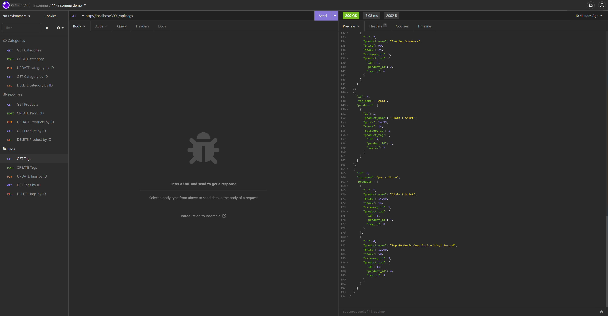

# E-Commerce-Back-End

[](https://opensource.org/licenses/MIT)



## Description
This E-commerce back end is made using Express.js API and Sequelize to access a MySQL database. 

[Watch the demo of the application](https://watch.screencastify.com/v/pavGO3UTZv7fvGGxrZ48)

## Technology Used
* Express.js
* Dotenv
* mysql2
* sequelize


## Code Snippet

Here is an example of a router.get that returns all from the Products table including information from the model Category and Tag

```JavaScript
router.get("/", async (req, res) => {
  try {
    const productData = await Product.findAll({
      include: [{ model: Category }, { model: Tag }],
    });
    if (!productData) {
      res.status(404).json({ message: "No product found" });
      return;
    }
    res.status(200).json(productData);
  } catch (err) {
    res.status(500).json(err);
  }
});
```
Here is the Products Model I created using Sequelize in order to generate a table in a MySQL database.

```JavaScript
Product.init(
  {
    id: {
      type: DataTypes.INTEGER,
      allowNull: false,
      primaryKey: true,
      autoIncrement: true,
    },
    product_name: {
      type: DataTypes.STRING,
      allowNull: false,
    },
    price: {
      type: DataTypes.DECIMAL(10, 2),
      allowNull: false,
      validate: {
        isDecimal: true,
      },
    },
    stock: {
      type: DataTypes.INTEGER,
      allowNull: false,
      defaultValue: 10,
      validate: {
        isAlphanumeric: true,
      },
    },
    category_id: {
      type: DataTypes.INTEGER,
      references: {
        model: 'category',
        key: 'id',
      },
    },
  },
  {
    sequelize,
    timestamps: false,
    freezeTableName: true,
    underscored: true,
    modelName: 'product',
  }
);
```

## Author Links 
[Github](https://github.com/mattjgatsby)
[LinkedIn](https://www.linkedin.com/in/matthew-gatsby-1a1521250/)